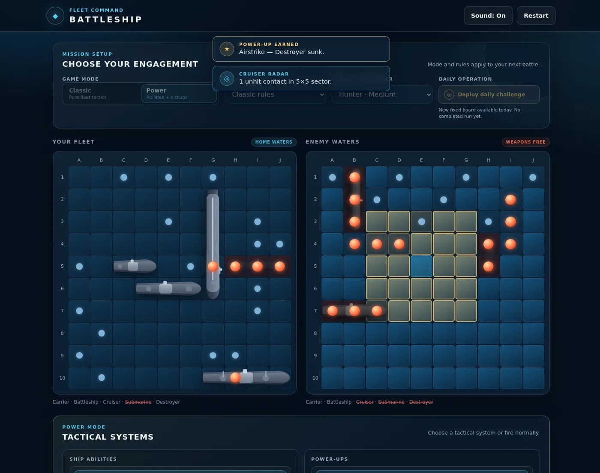
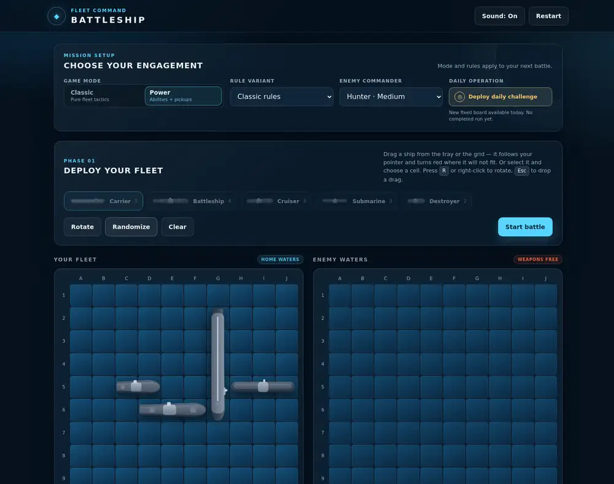

# Battleship: Fleet Command

[**▶ Play now — battleship2-xne9.vercel.app**](https://battleship2-xne9.vercel.app/)

[](https://github.com/aackad21/battleship2/actions/workflows/ci.yml)
[](LICENSE)

A single-player Battleship game that runs entirely in the browser: plain HTML,
CSS, and native JavaScript modules, with no build step and no runtime
dependencies. Deploy a fleet by dragging it onto the grid, then fight one of
five AI commanders across two base modes and seven rule variants.



A short capture of deployment and a Power-mode engagement:



## Features

- **Two base modes.** Classic is pure Battleship. Power adds one charge of each
  surviving ship's ability plus power-ups earned during the battle.
- **Seven rule variants**, selectable in either base mode.
- **Five AI commanders**, from uniform random fire to placement-probability
  scoring.
- **Five ship abilities** (Carrier Recon, Battleship Salvo, Cruiser Radar,
  Submarine Stealth, Destroyer Sonar), each usable once and lost when the ship
  sinks.
- **Five power-ups** (Radar Scan, Airstrike, Repair, Decoy, Extra Shot), earned
  for every three confirmed hits and for each enemy ship sunk. Scans report
  contact counts rather than exact cells.
- **Translucent heads-up cards** that state the result of every ability and
  power-up as it resolves, alongside the battle log.
- **Daily operation:** a deterministic board seeded from the local date, fixed to
  Classic mode, Limited ammo, and the Probability commander.
- **Career profile stored in the browser:** cumulative games, wins, losses,
  streaks, accuracy, six achievements, and cosmetic preferences (ocean theme,
  hit effect, fleet flag, victory signal).
- **Tactical replay:** up to 20 stored match timelines with step-by-step board
  playback.

Ranked play, leaderboards, online multiplayer, and social features are out of
scope; the game is single-player against the local AI.

### Rule variants

| Variant | Change from standard play |
|---|---|
| Classic rules | 10×10 board, five-ship fleet, one shot per side per turn. |
| Salvo | One shot per surviving ship each turn. |
| Rapid fire | Three shots per turn. |
| One-shot | A hit sinks the whole ship. |
| Compact 8×8 | 8×8 board with the standard fleet. |
| Armada fleet | Adds a two-section Patrol Boat (six ships, 19 occupied cells). |
| Limited ammo | The player has 32 total shots; running out is a loss. |

### Enemy commanders

| Commander | Behaviour |
|---|---|
| Random · Easy | Chooses uniformly from unresolved cells. |
| Hunter · Medium | Parity hunting, then follows and aligns around hits. |
| Probability · Hard | Scores cells from all still-plausible ship placements. |
| Aggressive · Hard | Hunt/target logic with extra pressure on central lanes. |
| Deceptive · Hard | Alternates perimeter and diagonal pressure before parity hunting. |

The fleet is Carrier (5), Battleship (4), Cruiser (3), Submarine (3), and
Destroyer (2). Ships may touch but cannot overlap or leave the board.

## Controls

Deployment, pointer or touch:

- Drag a ship out of the tray, or drag a ship already on the grid to reposition
  it. The section you grabbed stays under the pointer.
- An illegal drop position tints red; release over it and the ship returns.
- <kbd>Escape</kbd> cancels the drag in progress.
- Click a tray ship to select it, then click a cell to place it there.
- <kbd>R</kbd>, right-click (on the tray or the grid), or the **Rotate** button
  switches between horizontal and vertical, including mid-drag.
- **Randomize** places the whole fleet, **Clear** empties the grid, and **Start
  battle** unlocks once every ship is deployed.

Battle:

- Click a cell in Enemy waters to fire. In Power mode, click an ability or
  power-up first, then click the target cell it needs; <kbd>Escape</kbd> clears
  that selection.

Keyboard only:

- Grid cells, tray ships, abilities, and power-ups are real buttons, so
  <kbd>Tab</kbd> and <kbd>Shift</kbd>+<kbd>Tab</kbd> reach them and
  <kbd>Enter</kbd> or <kbd>Space</kbd> activates them: select a tray ship, focus
  a cell, and place; then focus an enemy cell and fire. Cells that cannot be
  used in the current phase are skipped.
- <kbd>R</kbd> rotates during deployment, and <kbd>Escape</kbd> closes the replay
  viewer. Focus stays inside the result and replay dialogs while they are open.

## Browser support

Any current release of Chrome, Edge, Firefox, or Safari runs the game. There is
no transpilation or polyfill layer, so the browser must itself support:

- **ES modules** with `import`/`export`, optional chaining, and `??`
  (`index.html` loads `js/main.js` as `type="module"`) — the reason the page has
  to be served over HTTP rather than opened as a `file://` URL.
- **Pointer events** (`pointerdown`/`pointermove`/`pointerup`, `pointerId`) for
  drag deployment.
- **CSS `color-mix()`** in `srgb`, used throughout the theme, and
  `backdrop-filter` for the translucent panels and heads-up cards. Without
  `backdrop-filter` the panels stay readable but lose the blur.
- **`localStorage`** for the career profile, daily records, and sound
  preference. Access is wrapped, so in a browser that blocks storage the game
  still plays with in-memory records for the session only.
- **`HTMLAudioElement`** for the pooled sound effects (no Web Audio API).
  Sound can be muted in the header.

`color-mix()` is the newest requirement; by its shipping dates that implies
roughly Chrome/Edge 111+, Firefox 113+, and Safari 16.2+. Treat those numbers as
an inference from that one API, not as tested versions.

## Run locally

No installation is needed — the repository has no dependencies. It only has to
be served, because ES modules do not load from the filesystem.

```bash
npm start                       # python3 -m http.server 8000
# open http://localhost:8000/index.html
```

## Tests

```bash
npm test                 # all headless suites
npm run test:engine      # core rules, variants, and AI
npm run test:powers      # abilities and defenses
npm run test:profile     # persistence, daily records, and replay
```

The suites are plain Node scripts and need no dependencies. They do not replace
browser acceptance testing.

## Docs

- [TESTING.md](TESTING.md) — consolidated debug report: defect register and
  validated fixes.
- [docs/acceptance-test-plan.md](docs/acceptance-test-plan.md) — manual
  black-box test plan.
- [Project wiki](https://github.com/aackad21/battleship2/wiki) — longer-form
  design and rules notes.
- [CREDITS.md](CREDITS.md) — sound and art attribution.

## Project layout

```text
index.html                    UI structure and dialogs
css/styles.css                layout, themes, effects, and animation
js/constants.js               modes, variants, fleets, and configuration
js/board.js                   placement, shots, sinking, and repair
js/ai.js                      five AI strategies
js/game.js                    phases, quotas, outcomes, events, and stats
js/powers.js                  abilities, power-ups, and defensive interception
js/profile.js                 local records, achievements, daily data, and replay
js/audio.js                   sound pooling and mute persistence
js/main.js                    DOM wiring and presentation
tests/                        headless engine, power, and profile suites
tools/generate_ships.py       ship SVG generator
```

## License

Released under the MIT License; see [LICENSE](LICENSE). Sound effects are CC0
from OpenGameArt, credited in [CREDITS.md](CREDITS.md).
